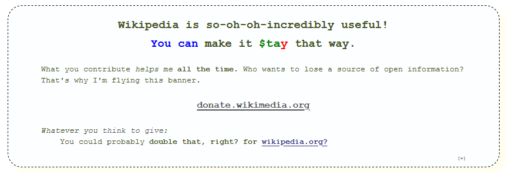

# wikipedia-props
Encouraging donations to the [Wikimedia Foundation](https://donate.wikimedia.org/) for everyone's benefit. I use it as a reference, and so do you, right?

Above is only an example of what this code outputs...to actually [donate to support Wikipedia click here](https://donate.wikimedia.org/).
